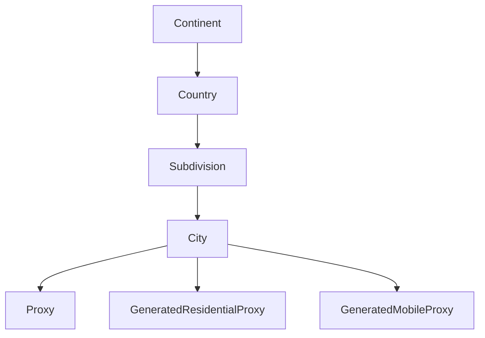

The City object represents a geographic city in the Byteful system. It contains essential information about a city including its name, location coordinates, timezone, and relationships to larger geographic divisions like countries and subdivisions. The City object is fundamental to the geographic targeting capabilities of proxies, especially for residential proxy services.

## Key Attributes

| Attribute | Type | Description |
|-----------|------|-------------|
| `city_id` | integer | Unique identifier for the city |
| `city_name` | string | Full name of the city (e.g., "Paris") |
| `city_alias` | string | Human-friendly unique identifier for the city (e.g., "city_of_lights") |
| `city_latitude` | number | Latitude coordinates of the city |
| `city_longitude` | number | Longitude coordinates of the city |
| `city_timezone` | string | Timezone of the city (e.g., "Europe/Paris") |
| `city_population` | integer | Population of the city |
| `city_is_populous` | boolean | Indicates if the city is among the populous cities in its region |
| `city_example_postcode` | string | Example postal/zip code for the city |
| `subdivision_id` | string | ID of the subdivision (state/province) where the city is located |

## Object Relationships

The City object is connected to several other objects in the Byteful API:

- **Subdivision**: Each city belongs to a subdivision (state, province, region)
- **Country**: Through the subdivision hierarchy, cities are associated with countries
- **Continent**: Through the country hierarchy, cities are associated with continents
- **Proxies**: Proxies can be geo-located in specific cities
- **Residential Proxies**: Residential proxy generation can target specific cities
- **Mobile Proxies**: Mobile proxy generation can target specific cities



## Related Endpoints

| Endpoint | Description |
|----------|-------------|
| `GET /public/user/city/retrieve/{city_id}` | Retrieve a specific city by ID |
| `GET /public/user/city/search` | Search cities using various filters |
| `GET /public/user/residential/list?city_alias={city_alias}` | Generate residential proxies for a specific city |
| `GET /public/user/mobile/list?city_alias={city_alias}` | Generate mobile proxies for a specific city |

## Example Response

```json
{
  "data": {
    "city_alias": "chittagong",
    "city_creation_datetime": "2024-07-03 13:48:00",
    "city_example_postcode": null,
    "city_id": 377157,
    "city_is_populous": true,
    "city_last_update_datetime": "2024-07-03 13:48:00",
    "city_latitude": 22.3384,
    "city_longitude": 91.83168,
    "city_name": "Chattogram",
    "city_node_count": 0,
    "city_population": 3920222,
    "city_timezone": "asia/dhaka",
    "subdivision_id": "bd-b"
  },
  "message": "City successfully retrieved."
}
```

## Usage Notes

- The `city_alias` is particularly important for residential/mobile proxy targeting
- The `city_is_populous` flag indicates cities that are among the top ten largest in their timezone with at least 300,000 population
- Geographic targeting by city provides the most granular level of geographic control for proxy selection
- Not all cities are available for residential/mobile proxy targeting - generally only those with `city_is_populous` set to true
- The `city_timezone` attribute is useful for time-sensitive operations that need to account for local time
- When searching for cities, you can filter by country using the `country_id` parameter or by subdivision using the `subdivision_id` parameter
- The combination of city latitude and longitude can be used for geolocation services and mapping integrations
