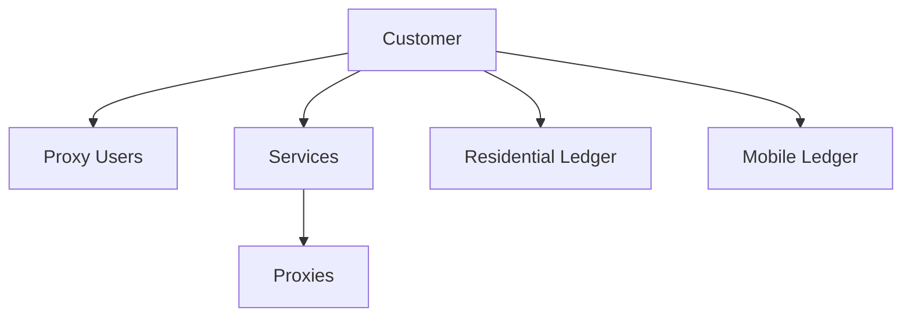

The Customer object represents an account holder in the Byteful system. It contains information about the account, including its type, organization details, billing information, and account settings. The Customer object describes the account, not the individual users who can access it.

## Key Attributes

| Attribute | Type | Description |
|-----------|------|-------------|
| `customer_id` | integer | Unique identifier for the customer |
| `customer_type` | string | Type of account: `personal` or `organization` |
| `user_id_owner` | string | ID of the user who owns the account |
| `customer_organization_name` | string | Name of the organization |
| `customer_organization_legal_id` | string | Legal registration number of the organization |
| `customer_domain` | string | Domain of the organization |
| `customer_billing_tax_id` | string | Tax ID used for billing |
| `customer_billing_tax_id_type` | string | Type of the billing tax ID (e.g., `eu_vat`) |
| `credit_balance` | integer | Available credit balance in cents |
| `customer_proxy_user_limit` | integer | Maximum number of proxy users allowed |
| `proxy_count` | integer | Total number of proxies associated with the account |
| `residential_bytes_left` | integer | Remaining residential data in bytes |
| `active_residential_service_id` | string | ID of the active residential service |
| `mobile_bytes_left` | integer | Remaining mobile data in bytes |
| `active_mobile_service_id` | string | ID of the active mobile service |

## Object Relationships

The Customer object is a parent to several other objects in the Byteful API:

- **Proxy Users**: Authentication entities created by the customer
- **Services**: Subscriptions to proxy products
- **Proxies**: Individual proxies allocated to the customer's services
- **Residential Ledger**: Records of residential data usage
- **Mobile Ledger**: Records of mobile data usage



## Related Endpoints

| Endpoint | Description |
|----------|-------------|
| `GET /public/user/customer/retrieve` | Retrieve the authenticated customer's profile |

## Example Response

```json
{
  "data": {
    "customer_id": 1955,
    "customer_type": "organization",
    "user_id_owner": "975ce262-4626-4ab3-83ca-f3f504bc1a8a",
    "customer_organization_name": "Apple Inc.",
    "customer_organization_legal_id": "12345678",
    "customer_domain": "apple.com",
    "customer_billing_tax_id": "GB123456789",
    "customer_billing_tax_id_type": "eu_vat",
    "credit_balance": 1245,
    "customer_proxy_user_limit": 5,
    "proxy_count": 100,
    "residential_bytes_left": 10737418240,
    "active_residential_service_id": "1955-8012-871",
    "mobile_bytes_left": 10737418240,
    "active_mobile_service_id": "1935-1517-112"
  },
  "message": "Customer successfully retrieved."
}
```

## Usage Notes

- The `credit_balance` is displayed in cents (e.g., 1245 means $12.45)
- When purchasing via API, services must be paid with account credit
- The `residential_bytes_left` shows remaining data for residential proxies
- The `mobile_bytes_left` shows remaining data for mobile proxies
- The `customer_proxy_user_limit` determines how many proxy users you can create
- The Customer object no longer returns personal user details such as email address, first name, or last name

## Best Practices

- Regularly check your `credit_balance` before making API purchases
- Monitor your `residential_bytes_left` and `mobile_bytes_left` to avoid service interruptions
- Use the `customer_id` to reference your account in support requests
